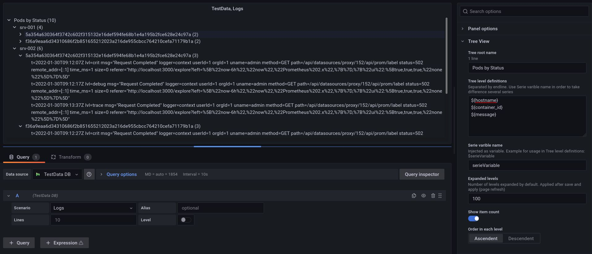

# Grafana Tree Panel Plugin

[](https://github.com/pgillich/grafana-tree-panell/actions?query=workflow%3A%22CI%22)

This plugin can show a tree from records provided by a datasource. This panel is optized and tested with [JSON API](https://grafana.com/grafana/plugins/marcusolsson-json-datasource/) datasource.

This panel is developed for presenting Kubernetes resources received from Kubernetes API. A possible production environment is described at <https://github.com/pgillich/grafana-kubernetes>.

Example screenshot about a Kubernetes Namespace:


## Datasource

All values from datasource are converted to string. The best datasource is [JSON API](https://grafana.com/grafana/plugins/marcusolsson-json-datasource/), but other datasources may also be used, for example TestData Logs:



The number of values in fields must be seme, so missing values must be substituted. [JSON API](https://grafana.com/grafana/plugins/marcusolsson-json-datasource/) supports JSONata, so it's possible. Example JSONata expression for Kubernetes API, which substitutes the missing values (`appName`, `containerState`) and generates string about lists (`containerImage`, `containerState`):

```jsonata
$map(items, function($v) {{"namespace": $v.metadata.namespace, "name": $v.metadata.name, "appName": $v.metadata.labels."app.kubernetes.io/name" ? $v.metadata.labels."app.kubernetes.io/name" : ($v.metadata.labels."app" ? $v.metadata.labels."app" : "-"), "statusPhase": $v.status.phase, "containerCount": $count($v.spec.containers), "containerImage": $join($v.spec.containers[*].image, " "), "containerState": $v.status.containerStatuses[*].state ? $string($v.status.containerStatuses[*].state) : "-", "cluster": $serieVariable}})
```

It's highly recommended to use same JSONata expression in field definition, only the selected field should be different, for example:


## Panel Options

Option descriptions can be read on the panel option editor:


## Example Dashboards

Example dashboards can be found in [examples](examples).

## Development

The skeleton was created by <https://www.npmjs.com/package/@grafana/toolkit>. The typical developing use cases are described there. Jest snapshot is also used, so snapshots can be updated by `--updateSnapshot` option.

Running Grafana - which can access a Kubernetes API - in Docker Compose envirent is possible, only a `kubectl proxy` command is needed, for example:

```sh
kubectl proxy --address 0.0.0.0 --accept-hosts='.*' --reject-methods=POST,PUT,PATCH -v5
```

The HTTP URL of JSON API datasource should be set to the external or docker IP address of the host.

The `dist` directory should be mounted to the Grafana container and should be able to load without signature, see the related config options for a `docker-compose.yml`:

```yaml
services:
  grafana:
    volumes:
      - ./grafana/grafana-tree-panel/dist:/var/lib/grafana/plugins/pgillich-tree-panel
    environment:
      - GF_PLUGINS_ALLOW_LOADING_UNSIGNED_PLUGINS=pgillich-tree-panel
```

Above should be added to a `docker-compose.yml`, see example environment here: <https://github.com/pgillich/dockprom>. After running `yarn build`, Below command restarts the Grafana container:

```sh
docker-compose stop grafana && docker rm -fv grafana && docker-compose up -d grafana
```
